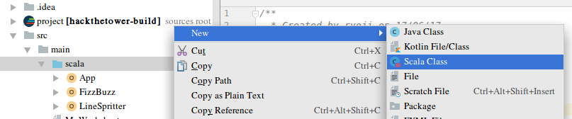

2017 06 13 London Java Community Hack The Tower
===============================================
https://tsrtesttest.appspot.com/wiki/scala

You've got to use

|scala  |sbt     |scalaTest|
|:-----:|:------:|:-------:|
|v2.12.2|v0.13.15|v3.0.0   |

build.sbt
```
scalaVersion := "2.12.2"
libraryDependencies += "org.scalatest" %% "scalatest" % "3.0.0" % Test
```

Scala Sheet
-----------


Object with main(args[])
------------------------



Define function
---------------
```
def getResult(number: Int): String = {
def main(args: Array[String]): Unit = {
```

function is a value
-------------------
http://alvinalexander.com/scala/how-to-use-functions-as-variables-values-in-scala-fp
```
val double = (i: Int) => { i * 2 }
```
is equivalent to
```
def double(i: Int) = {
  i * 2 //return
}
```

```
val f: (Int) => Boolean = i => { i % 2 == 0 }
```
is equivalent to
```
def f(i: Int): Boolean => {
  i % 2 == 0 //return
}
```

under score
-----------
?, default, it
```
val f: Int => Boolean = _ % 2 == 0
```
is equivalent to
```
def f(_: Int): Boolean => {
  _ % 2 == 0 //return
}
```

Return
------
http://docs.scala-lang.org/tutorials/tour/pattern-matching.html
```
if   return a
else return b
```
```
def matchTest(x: Int): String = x match {
  case 1 => "one"
  case 2 => "two"
  case _ => "many"
}
```

Extra keywords
--------------
```
Unit / void .wrap()
Explicit approach, Inplicit approach //val add: (Int, Int) => Int = (x,y) => x + y
```

http://twitter.github.io/effectivescala/

Haskell
=======
```
:type (&&)
(&&) :: Bool -> Bool -> Bool
```
is equivalent to like
```
$man &&

&&(1)                    BSD General Commands Manual                   &&(1)

NAME
       && - evaluate both expr`A` and expr `B` are true

SYNOPSIS
       && A:Bool B:Bool [options] [pathname ...]

DESCRIPTION
       Display the result of evaluation of expressions in Bool.

       The two expressions are mandatory arguments.
```

```
    e = 2.7182818284 :: Float
    k = v :: t
```
is equivalent to scala's
```
val e: Double = 2.7182818284

*println(e)
e: Double = 2.7182818284
2.7182818284
```

Definition of HashMap is
```
$:t HashMap
HashMap :: * -> * -> *
```